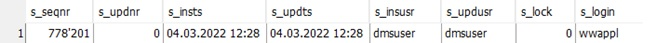

# Einsatz der Prozeduren

- [Einsatz der Prozeduren](#einsatz-der-prozeduren)
  - [Prozeduraufruf Insert](#prozeduraufruf-insert)
    - [DmsImport](#dmsimport)
    - [DmsBeleg](#dmsbeleg)
    - [DmsBelegPosten](#dmsbelegposten)
  - [Prozeduraufruf Update](#prozeduraufruf-update)
    - [DmsImport](#dmsimport-1)
    - [DmsBeleg](#dmsbeleg-1)
    - [DmsBelegPosten](#dmsbelegposten-1)
  - [Löschen von Importen](#löschen-von-importen)

## Prozeduraufruf Insert

Es gibt jeweils zwei Prozeduren für den Insert. «p_insert_Dms…» und «pv_insert_Dms…». Im Gegensatz zur zweiten Variante, gibt die erste Variante mit nur «p» ein Ergebnis zurück.


 
Die s_seqnr ist der Primary Key des eben erzeugten Eintrages und muss als Foreign Key in den abhängigen Tabellen verwendet werden. Also kommt der PK der Tabelle DmsImport in die Spalte dmsimport_seqnr der Tabelle DmsBeleg und der PK der Tabelle DmsBeleg in die Spalte dmsbeleg_seqnr der Tabelle DmsBelegPosten.

### DmsImport

```sql
CALL "wwappl"."p_insert_DmsImport"(
    "@s_insusr" = 'wwdms', -- Benutzer welcher die DB Einträge macht
    "@dmsarchiveguid" = 'F103D065-A2DF-472B-12BB2E4006F4', -- GUID
    "@dmsdateiname" = 'Beispiel.pdf',
    "@dmsdocumentguid" = NULL,
    "@dmsdocumentid" = 123456789,
    "@dmsimportfehlercode_seqnr" = NULL,
    "@dmsimportstatus_seqnr" = 1,
    "@dmsinsts" = '28-02-2022',
    "@dmsinsusr" = 'AS',
    "@dmsupdatets" = '28-02-2022',
    "@dmsupdateusr" = 'AS'
)
```

### DmsBeleg

```sql
CALL "wwappl"."p_insert_DmsBeleg"(
    "@s_insusr" = 'wwdms', -- Benutzer welcher die DB Einträge macht
    "@belegcode_seqnr" = null,
    "@belegartnr" = 1,
    "@belegdatum" = '28-02-2022',
    "@belegnummer" = '1234',
    "@benoetigtgeraeteintrag" = 0,
    "@benoetigtunterhalteintrag" = 0,
    "@buchungdatum" = NULL,
    "@dmsimport_seqnr" = 778199, -- FK auf die Tabelle DmsImport
    "@esrreferenznummer" = '121234567890123456789012345',
    "@hatzahlungsperre" = 0,
    "@kreditor_seqnr" = 8518,
    "@kreditorco" = '',
    "@kreditorgeschlechtnr" = NULL,
    "@kreditorland" = '',
    "@kreditormwstnr" = '',
    "@kreditorname" = '',
    "@kreditorplz" = '',
    "@kreditorpostfach" = '',
    "@kreditorstrasse" = '',
    "@kreditorvorname" = '',
    "@kreditorzahlstellekontodetail" = '01-103427-1',
    "@mand_seqnr" = 3,
    "@qrcodepayload" = '',
    "@rechnungnummer" = 12345,
    "@zahlstellekreditor_seqnr" = 6774,
    "@zahlstellemandant_seqnr" = NULL,
    "@zahlunggrund" = '',
    "@zahlungkonditionfaelligkeit" = 30,
    "@zahlungkonditionfaelligperdatum" = NULL
)
```

### DmsBelegPosten

```sql
CALL "wwappl"."p_insert_DmsBelegPosten"(
    "@s_insusr" = 'wwdms', -- Benutzer welcher die DB Einträge macht
    "@betragbrutto" = 430.75,
    "@betragexklmwst" = 0.00,
    "@betragmwstvoll" = 0.00,
    "@buchungtext" = 'Swisscom, März',
    "@dmsbeleg_seqnr" = 778197, -- FK auf die Tabelle DmsBeleg
    "@faelligkeitdatum" = '30-03-2022',
    "@konto_seqnr" = 47515,
    "@kostenstelle_seqnr" = NULL,
    "@mahnungtyp_seqnr" = 11,
    "@menge" = NULL,
    "@mwstabrechnungziffer_seqnr" = 1,
    "@mwstcode_seqnr" = NULL,
    "@mwstsatz" = 7.60,
    "@nkabrechnungperiodestichtag" = NULL,
    "@nr" = 1,
    "@preisproeinheit" = NULL,
    "@vorsteueranteil" = NULL
)
```

## Prozeduraufruf Update

Die Updateprozeduren funktionieren fast gleich wie die Insert Prozeduren. Der Hauptunterschied liegt am «Header».

Header Insert Prozeduren:
-	@s_insusr

Header Update Prozeduren:
-	@s_seqnr
-	@s_updnr
-	@s_updusr

Mit Hilfe der beiden Varablen @s_seqnr und @s_updnr wird der zu verändernde Datensatz gefunden. @s_seqnr gibt den Foreign Key an und @s_updnr stellt sicher, dass man den aktuellen Datensatz geladen hat und er sich in der Zwischenzeit nicht verändert hat. Die restlichen Felder sind identisch.

### DmsImport

```sql
CALL "wwappl"."p_update_DmsImport"(
    "@s_seqnr" = 778193,
    "@s_updnr" = 0,
    "@s_updusr" = 'wwdms',
    "@dmsarchiveguid" = 'F103D065-A2DF-472B-12BB2E4006F4', -- GUID
    "@dmsdateiname" = 'Beispiel.pdf',
    "@dmsdocumentguid" = NULL,
    "@dmsdocumentid" = 123456789,
    "@dmsimportfehlercode_seqnr" = NULL,
    "@dmsimportstatus_seqnr" = 1,
    "@dmsinsts" = '28-02-2022',
    "@dmsinsusr" = 'AS',
    "@dmsupdatets" = '28-02-2022',
    "@dmsupdateusr" = 'AS'
)
```

### DmsBeleg

```sql
CALL "wwappl"."p_update_DmsBeleg"(
    "@s_seqnr" = 778193,
    "@s_updnr" = 0,
    "@s_updusr" = 'wwdms',
    "@belegcode_seqnr" = null,
    "@belegartnr" = 1,
    …
    "@zahlungkonditionfaelligkeit" = 30,
    "@zahlungkonditionfaelligperdatum" = NULL
)
```

### DmsBelegPosten

```sql
CALL "wwappl"."p_update_DmsBelegPosten"(
    "@s_seqnr" = 36114,
    "@s_updnr" = 0,
    "@s_updusr" = 'wwdms',
    "@betragbrutto" = 430.75,
    …
    "@preisproeinheit" = NULL,
    "@vorsteueranteil" = NULL
)
```

## Löschen von Importen

Es ist nicht möglich einen Import physisch zu löschen, man kann aber den dmsimportstatus mit Hilfe der Update Funktion in der Tabelle DmsImport auf -4 (Zu löschen) setzen.
