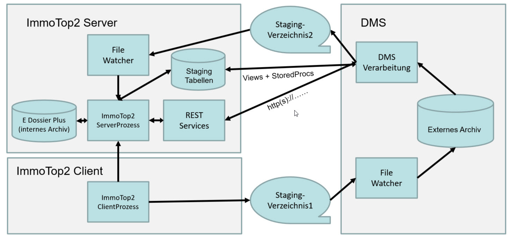

# immotop2-dms-schnittstelle

- [immotop2-dms-schnittstelle](#immotop2-dms-schnittstelle)
  - [Schnittstellen](#Schnittstellen)
  - [ImmoTop2 Views](#immotop2-views)
  - [Abfüllen der Staging-Tabellen](#abfüllen-der-staging-tabellen)
    - [DB Prozeduren](#db-prozeduren)
    - [Restservice](#restservice)
  - [StagingVerzeichnisse](./StagingVerzeichnisse.md)

#Offene DMS Schnittstelle für das Immobilien-ERP ImmoTop2

Dieses Dokument richtet sich an DMS Hersteller und Implementationspartner. Es enthält die Dokumentation über den Aufbau und Inhalt der universellen DMS Schnittstelle ImmoTop2. Das Dokument dient als Implementationshilfe und Nachschlagewerk für DMS Hersteller und Implementationspartner.

## Generelles
-	Ein Dokument existiert in ImmoTop2 nur ein einziges  (entweder im ImmoTop2-internen Archiv oder im externen Archiv eines DMS)
-	Master für die Indexwerte der Dokumente ist ImmoTop2.
-	Das DMS ermöglicht das Viaualisieren von Dokumenten durch Aufruf eines URL mit der DokumentenID als Platzhalter
-	Dokumente werden immer über eine eindeutige DocID identifiziert

## Schnittstellen

Die ImmoTop2-Schnittstellen ermöglichen den DMS:
- lesende und schreibende Zugriffe via <b>REST-Services</b>
- lesende Zugriffe via DatenbankViews und schreibende Zugriffe via Stored-Procedures über eine direkte <b>Datenbank-Schnittstelle</b> 
- ausführen von Commands (zB Lösche Dokument 123) über Steuerdateien in <b>Staging-Verzeichnissen</b>

ZU UEBERAREITEN
stellt Stammdaten dem DMS in Views zur Verfügung.

Das DMS erhält einen Benutzer für lesenden Zugriff. Die Verbindung auf die Views erfolgt mittels ODBC, zusätzlich denkbar wäre auch eine Verbindung mittels ADO.Net, OLE.DB. Ein REST WebService steht auch zur Verügung.

Der Beleg wird im DMS gescannt.

Der Beleg durchläuft im DMS einen Kreditoren-Workflow.

Metainformationen zum Beleg werden vom DMS in ImmoTop2 geschrieben. Hierfür hat das DMS Schreibrechte auf ausgewählte DMS-Tabellen vom ImmoTop2, sogenannte Staging-Tabellen.

In ImmoTop2 wird der Beleg geprüft. Die Daten werden gegebenenfalls ergänzt oder korrigiert und in die Buchhaltung geschrieben.

Die Rechnung wird über ImmoTop2 ausbezahlt.

## ImmoTop2 Datenbank-Views

Die nachfolgenden Views dienen der Workflow Engine des DMS dazu, die zulässigen Datenkombinationen zu ermitteln. Fragen, die beantwortet werden, sind: 

- Existiert der Kreditor bereits?
- Wie ist der Kontenrahmen des Mandanten?
- Welche Kostenstellen passen zum gewählten Konto?
- Soll mit Mwst gebucht werden oder nicht?
- Etc.

| View                                                                               | Details                                                     |
| :--------------------------------------------------------------------------------- | :---------------------------------------------------------- |
| [v_DmsImportFehlerCode](./_views/v_DmsImportFehlerCode.md)                         | View mit den Fehlercodes für das Importieren von Dokumenten |
| [v_DmsImportStatus](./_views/v_DmsImportStatus.md)                                 | Status der Importierten von Dokumente                       |
| [v_DmsMandant](./_views/v_DmsMandant.md)                                           | Information zu den Mandanten                                |
| [v_DmsMandantZahlstelle](./_views/v_DmsMandantZahlstelle.md)                       | Infromation zur Zahlstelle des Mandanten                    |
| [v_DmsKreditor](./_views/v_DmsKreditor.md)                                         | Informationen zu den Kreditoren                             |
| [v_DmsKreditorZahlstelle](./_views/v_DmsKreditorZahlstelle.md)                     | Zahlstellen der Kreditoren                                  |
| [v_DmsKonto](./_views/v_DmsKonto.md)                                               | Kontenplan                                                  |
| [v_DmsExportKonto](./_views/v_DmsExportKonto.md)                                   | Details zum Exportkonto.                                    |
| [v_DmsKontoKostenstelleTyp](./_views/v_DmsKontoKostenstelleTyp.md)                 | Kostenstellentyp pro Konto                                  |
| [v_DmsKontoKostenstelle](_views/v_DmsKontoKostenstelle.md)                         | Zulässige Kostenstelle pro Konto                            |
| [v_DmsKostenstelle](_views/v_DmsKostenstelle.md)                                   | Informationen zu den Kostenstellen                          |
| [v_DmsExportKostenstelle](_views/v_DmsExportKostenstelle.md)                       | Details zu Exportkostenstelle                               |
| [v_DmsMwstAbrechnungZiffer](_views/v_DmsMwstAbrechnungZiffer.md)                   | Mwst Abrechnungsziffern                                     |
| [v_DmsVorsteuerAnteil](_views/v_DmsVorsteuerAnteil.md)                             | Vorsteueranteile                                            |
| [v_DmsKostenGruppeKostenKonto](_views/v_DmsKostenGruppeKostenKonto.md)             | Vorsteueranteil zum Kostenkonto                             |
| [v_DmsMahnungTyp](_views/v_DmsMahnungTyp.md)                                       | Auswahl der möglichen Mahntypen                             |
| [v_DmsMwstCode](_views/v_DmsMwstCode.md)                                           | Mwst Codes                                                  |
| [v_MwstSatz](_views/v_DmsMwstSatz.md)                                              | Mwst Satz                                                   |
| [v_DmsAbrechnungPeriode](_views/v_DmsAbrechnungPeriode.md)                         | Abrechnungsperioden                                         |
| [v_DmsBelegCode](_views/v_DmsBelegCode.md)                                         | Belegcode                                                   |
| [v_DmsObjekt](_views/v_DmsObjekt.md)                                               | Informationen zu den Objekten                               |
| [v_DmsMieter](_views/v_DmsMieter.md)                                               | Informationen zu den Mietern                                |
| [v_DmsVerhaeltnis](_views/v_DmsVerhaeltnis.md)                                     | Informationen zu den Verhältnissen                          |
| [v_DmsCode](_views/v_DmsCode.md)                                                   | Codes                                                       |
| [v_DmsLiegenschaft](_views/v_DmsLiegenschaft.md)                                   | Informationen zu den Liegenschaften                         |
| [v_DmsLiegenschaftGruppeNebenkosten](_views/v_DmsLiegenschaftGruppeNebenkosten.md) | Informationen zu den Liegenschaftengruppe Nebenkosten       |
| [v_DmsBuchungDokument](_views/v_DmsBuchungDokument.md)                             | Buchungen zu deinem Dokument                                |
| [v_DmsMitarbeiter](_views/v_DmsMitarbeiter.md)                                     | Informationen zu den Mitarbeitern                           |
| [v_DmsZahlungposten](_views/v_DmsZahlungposten.md)                                 | Informationen zu den Zahlungen                              |
| [v_DmsBelegzahlungAngaben](_views/v_DmsBelegzahlungAngaben.md)                     | Angaben zu den Belegzahlungen                               |

## Abfüllen der Staging-Tabellen

Die Staging-Tabellen DmsImport, DmsBeleg und DmsBelegPosten können entweder direkt SQL Prozeduren befüllt werden oder mit Hilfe eines Rest Service.

### DB Prozeduren

Der Aufruf der Prozeduren ist in folgendem Dokument beschrieben: [EinsatzProzeduren](EinsatzProzeduren.md)

### Restservice

Verwendung des Webservices wird in diesem Dokument beschrieben: [RestService](RestService.md)
