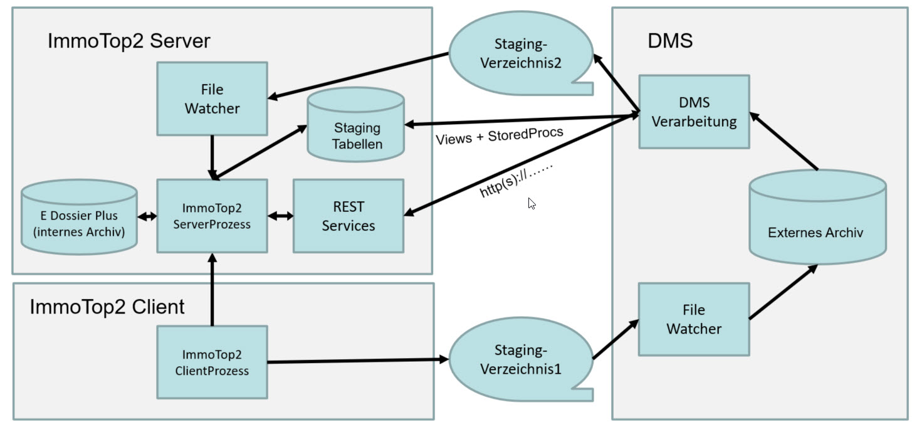
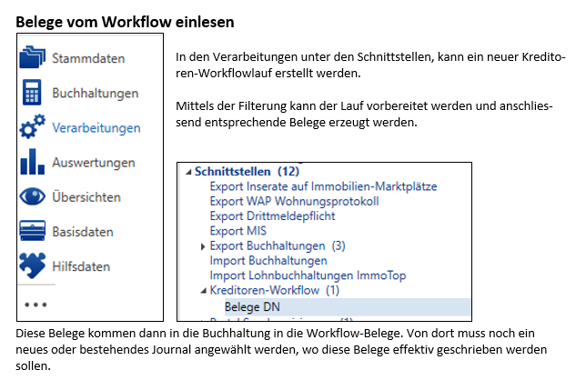

# immotop2-dms-schnittstelle

- [immotop2-dms-schnittstelle](#immotop2-dms-schnittstelle)
  - [Offene DMS Schnittstelle für das Immobilien-ERP ImmoTop2](#offene-dms-schnittstelle-für-das-immobilien-erp-immotop2)
  - [Generelles](#generelles)
  - [Schnittstellen](#schnittstellen)
  - [Daten lesen und schreiben in ImmoTop2](#daten-lesen-und-schreiben-in-immotop2)
    - [REST-Services](#rest-services)
    - [Datenbank-Schnittstelle](#datenbank-schnittstelle)
      - [DB Views](#db-views)
      - [DB Prozeduren](#db-prozeduren)
      - [Staging Tabellen](#staging-tabellen)
  - [Ablauf Kreditorenworkflow](#ablauf-kreditorenworkflow)

## Offene DMS Schnittstelle für das Immobilien-ERP ImmoTop2

Dieses Dokument richtet sich an DMS Hersteller und Implementationspartner. Es enthält die Dokumentation über den Aufbau und Inhalt der universellen DMS Schnittstelle ImmoTop2. Das Dokument dient als Implementationshilfe und Nachschlagewerk für DMS Hersteller und Implementationspartner.

## Generelles
-	Ein Dokument existiert in ImmoTop2 nur ein einziges Mal. (entweder im ImmoTop2-internen Archiv oder im externen Archiv eines DMS)
-	Master für die Indexwerte der Dokumente ist ImmoTop2. 
(nur die in ImmoTop2 gespeicherten Indexwerte sind für ImmoTop2 relevant. ImmoTop2 definiert, wo das Dokument gespeichert ist.)
-	Das DMS ermöglicht das Visualisieren von Dokumenten durch Aufruf einer URL mit der DokumentenID als Platzhalter
-	Dokumente werden immer über eine eindeutige DocID identifiziert, die ImmoTop2 geliefert werden muss nach dem Speichern des Dokumentes im externen DMS

## Schnittstellen

Die ImmoTop2-Schnittstellen ermöglichen den DMS:
- lesende und schreibende Zugriffe via <b>[REST-Services](RestService.md)</b>
- lesende Zugriffe via [DatenbankViews](UebersichtViews.md) und schreibende Zugriffe via [Stored-Procedures](EinsatzProzeduren.md) über eine direkte <b>Datenbank-Schnittstelle</b> 
- Dokumente zwischen dem DMS und ImmoTop2 transportieren oder ausführen von Commands (zB Lösche Dokument 123) über Steuerdateien in <b>[Staging-Verzeichnissen](StagingVerzeichnisse.md)</b>

## Daten lesen und schreiben in ImmoTop2

### REST-Services

REST-Services sind die bevorzugte Schnittstelle.
Die Verwendung der REST-Services wird in diesem Dokument beschrieben: [REST-Services](RestService.md)

### Datenbank-Schnittstelle
Für die Datenbank-Schnittstelle muss eine direkte Netzwerkverbindung vom DMS zur ImmoTop2-Datenbank existieren.
ImmoTop 2 stellt Stammdaten den DMS in [Views](UebersichtViews.md) zur Verfügung.

Das DMS erhält einen Benutzer für lesenden und schreibenden Zugriff. 
Die Verbindung auf die [Views](UebersichtViews.md) oder [DB Prozeduren](EinsatzProzeduren.md) erfolgt mittels [REST-Services](RestService.md), Alternativ stehen auch noch ODBC zur Verfügung (nicht mehr empfohlen).

Aus Performancegründen, wird empfohlen, die Daten Lokal in Zwischentabellen zu speichern und nicht in Echtzeit auf die Views oder den REST-Service zuzugreifen.

#### DB Views

Die DB Views sind in folgendem Dokument beschrieben: [Views](UebersichtViews.md)

#### DB Prozeduren

Der Aufruf der Prozeduren ist in folgendem Dokument beschrieben: [Prozeduren](EinsatzProzeduren.md)

#### Staging Tabellen

Details zu den Staging Tabellen sind hier dokumentiert:
- [DmsImport](_stagingTabellen/DmsImport.md)
- [DmsBeleg](_stagingTabellen/DmsBeleg.md)
- [DmsBelegPosten](_stagingTabellen/DmsBelegPosten.md)
- [DmsBelegPostenUnterhalt](_stagingTabellen/DmsBelegPostenUnterhalt.md)
- [DmsBelegPostenGeraet](_stagingTabellen/DmsBelegPostenGeraet.md)

## Ablauf Kreditorenworkflow

Der Beleg wird im DMS gescannt.

Der Beleg durchläuft im DMS einen Kreditoren-Workflow.

Metainformationen zum Beleg werden vom DMS in die [Staging Tabellen](#staging-tabellen) von ImmoTop2 geschrieben. Hierfür werden [Prozeduren](EinsatzProzeduren.md) und ein [REST-Services](RestService.md) zur Verfügung gestellt um die Daten in sogenannte Staging-Tabellen zu schreiben (DmsImport, DmsBeleg und DmsBelegPosten).

In ImmoTop2 wird der Beleg geprüft. Die Daten werden gegebenenfalls ergänzt oder korrigiert und in die Buchhaltung geschrieben.

Die Rechnung wird über ImmoTop2 ausbezahlt.

