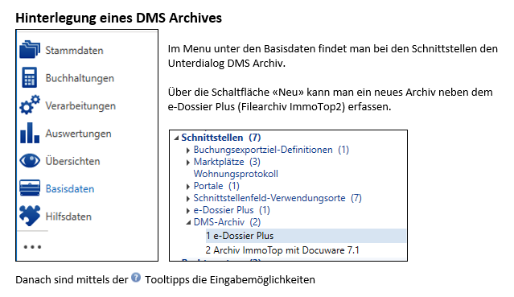
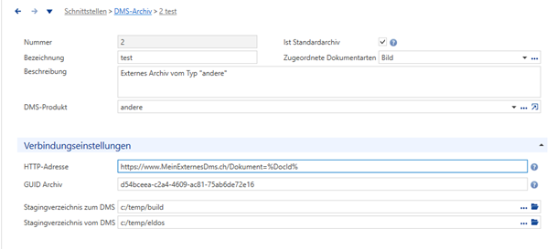
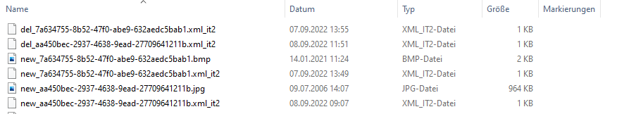
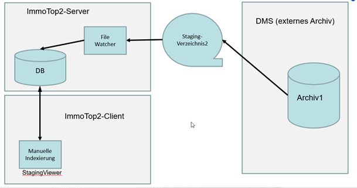

# Schnittstelle Staging-Verzeichnisse
Die Staging-Verzeichnisse werden als einheitliche Lowtech-Schnittstelle für die Kommunikation zwischen ImmoTop2 und verschiedenen DMS genutzt.
Es werden zwei Staging-Verzeichnisse benötigt:
- Stagingverzeichnis1: Steuerdateien und evtl. Dokumente von ImmoTop2 an das DMS
- Stagingverzeichnis2: Steuerdateien und evtl. Dokumente vom DMS an ImmoTop2

<br><br>


## Steuerdatei
Die Steuerdatei enthält Metadaten eines Dokuments und Steuer-Anweisungen. Sie:
- hat XML-Format
- wird erst nach dem Dokument in das Stagingverzeichnis geschrieben

### Namengebung der Steuerdateien
Die eindeutigen Namen des Dokumentes und der Steuerdatei müssen sich entsprechen., dh. Namen der beiden Dateien unterscheiden sich nur im Filesuffix. 
Damit auch XML-Dateien zwischen den beiden Software-Systemen ausgetauscht werden können, hat die XML-Steuerdatei den proprietären FileSuffix «xml_it2».

Möglicher Inhalt eines Stagingverzeichnisses:<br>


### Struktur einer Steuerdatei
| Name des XML-Elements    | Werte           | Bemerkungen  |
| :----------------------- | :------------   | :--------------------------------------------   |
| Version                  | 1.0             | Ermöglicht zukünftige Erweiterungen/Modifikationen der Steuerdatei  |
| Action                   | NewDocument     | Neues Dokument im DMS speichern  |
|                          | SavedDocument   | Datei wurde im DMS gespeichert, das DMS liefert Infos des gespeicherten Dokumentes zurück an ImmoTop2. |
|                          | GetDocumenInfos | Falls "SavedDocument" verloren ging oder..., kann ImmoTop2 die Infos zu einem Dokument erneut anfordern |
|                          | DeleteDocument  | Datei im DMS löschen |
|                          | ReplaceDocument | Wird nicht implementiert, es muss DeleteDocument/NewDocument benutzt werden.<br>Damit ist die Dokumentensynchronisation mit dem Portal einfach möglich. |
| DmsArchivId              | Text            | Eindeutige ID des Archivs, in dem das Doku-ment gespeichert wird<br>Dient dem ArchivMapping beim Kreditoren-Workflow  |
| DmsDocumentId            | Text            | Eindeutige ID eines Dokuments im DMS<br>Wird für die Visualisierung der Dokumente via DMS-DocumentViewer benötigt.  |
| DocumentId               | Text            | Eindeutige ID eines Dokuments in ImmoTop2<br>Primärschlüssel des Dokuments, der für die REST- oder Datenabnkschnittstelle benutzt werden kann.  |
| DateiName                | Text            | Sprechender Dateiname   |

### Beispiele von Steuerdateien

#### Beispiel1: Ein ImmoTop2-Benutzer will ein neues Dokument im DMS speichern:
 ```
 <?xml version="1.0" encoding="utf-8"?>
<ControlFile>
<Action>NewDocument</Action>
<DmsArchivId>Archiv1</DmsArchivId>
<DmsDocumentId />
<DocumentId>117</DocumentId>
<DateiName>qrcode.bmp</DateiName>
</ControlFile>
```

#### Beispiel2: Das DMS teilt ImmoTop2 Informationen zum gespeicherten Dokument mit:
```
<?xml version="1.0" encoding="utf-8"?>
<ControlFile>
<Action>SavedDocument</Action>
<DmsArchivId>Archiv1</DmsArchivId>
<DmsDocumentId>1234</DmsDocumentId>
<DocumentId>117</DocumentId>
<DateiName>qrcode.bmp</DateiName>
</ControlFile>
```

# Use Cases
## UseCase1: ImmoTop2 will ein Dokument ins DMS schreiben
ImmoTop2 kennt Dokumentarten (Bilanz, Erfolgsrechnung, ....).
Für jede Dokumentart:
- ist festgelegt, welche Indexwerte optional/mandatory beim Speichern eines Dokumentes gesetzt werden müssen.
- kann der Benutzer via Checkbox "Ablage DMS" konfigurieren, ob Dokumente in internen oder einem externen Archiv gespeichert werden sollen.

Ein Kunde kann mehrere externe DMS-Archive zB in verschiedenen Versionen nutzen.<br>
Genau eines der externen Archive muss als "Standardarchiv" konfiguriert sein, damit ImmoTop2 weiss, wohin ein neues Dokument geschrieben werden soll.
Bereits gespeicherte Dokumente bleiben dort, wo sie initial gespeichert wurden.

Ablauf:
- ImmoTop2 schreibt einen Verweis-Datensatz ins interne Archiv, der die Adressdaten des extern gespeicherten Dokuments enthält
- ImmoTop2 schreibt dann eine Steuerdatei mit Action "NewDocument" in den Stagingfolder1 und liefert dabei den Primärschlüssel des Dokuments (XML-Element "DocumentId")
- Danach schreibt ImmoTop2 das Dokument in den Stagingfolder1
- Das DMS erkennt die Steuerdatei und schreibt das Dokument ins  DMS-Archiv
- Das DMS löscht danach sowohl die Steuerdatei als auch das Dokument im Stagingfolder1
- Nun liefert das DMS im StagingFolder2 eine Steuerdatei mit Action "SavedDocument"<br>Diese Steuerdatei enthält die ID des Dokumentes (Element "DmsDocumentId"), die für das Löschen bzw. die Visualisierung eines Dokuments via DMS-Documentviewer benötigt wird 
- ImmoTop2 verarbeitet diese Steuerdatei (aktualisiert den Verweis-Datensatz im internen Archiv) und löscht dann die Steuerdatei in StagingFolder2

## UseCase2: ImmoTop2-Benutzer will ein Dokument sehen, das im DMS gespeichert ist
ImmoTop2 weiss, dass das vom Benutzer verlangte Dokument in einem externen Archiv gespeichert ist und baut den URL für den DMS-Documentviewer anhand des für das Archiv hinterlegten URL.
Die im URL hinterlegten Platzhalter «%DocId%» in «%ArchivId%» werden durch die effektiven DocId bzw ArchivId ersetzt.
Danach wird der Standardbrowser gestartet und das Dokument über den DMS-DocumentViewer im Browser geöffnet.<br>
Der DMS-Documentvieser ermöglicht dann den Download, das Drucken,... eines Dokumentes. 

## UseCase3: ImmoTop2 will ein Dokument im DMS löschen
Ein Benutzer hat sich entschieden, ein Dokument zu löschen.
ImmoTop2 weiss anhand der Konfigurationsdaten, dass das zu löschende Dokument in einem externen Archiv gespeichert ist.

Ablauf:
- ImmoTop2 schreibt eine Steuerdatei mit Action "DeleteDocument" in den Stagingfolder1
- ImmoTop2 löscht den Verweis auf das Dokument in seiner Datenbank
- Das DMS löscht das Dokument im Archiv anhand des XML-Elementes "DmsDocumentId"
- Das DMS löscht die Steuerdatei im Stagingfolder1

## UseCase4: Das DMS liest die ImmoTop2-Indexwerte eines oder mehrerer Dokumente
Wenn das DMS neben der ImmoTop2-DocId zusätzlich auch noch weitere Indexwerte (=Dokument-Metadaten) in numerischer und/oder in Textform benötigt (zB Name eines Mandanten). <br>
Das <b>Synchronisieren der Indexwerte muss im externen DMS periodisch ausgeführt</b> werden, denn Indexwerte können in ImmoTop2 jederzeit ändern (zB Name einer Liegenschaft)

ImmoTop2 liefert beim Schreiben eines Dokumentes den Primärschlüssel (XML-Element "DocumentId").
Anhand dieses Primärschlüssels kann das DMS weitere Indexwerte eines Dokumentes anhand der View "[v_DmsDokumentIndexFelder](_views/v_DmsDokumentIndexFelder.md)" oder des [REST-Service](RestService.md) "GetDmsDokumentIndexFelderByDmsDocumentId" lesen.<b>
Für praktisch alle DB-Views existieren als Alternative auch ImmoTop2-REST-Services</b>.

Sollten diese Indexwerte nicht alle gewünschten Daten enthalten, können mit weiteren REST-Services oder DB-Views zusätzliche Daten aus ImmoTop2 gelesen werden.
So liefert zB die View "v_DmsMandant" den Namen, den Typ,… des Mandanten.

## UseCase5: ImmoTop2 integriert DMS Dokumente (noch nicht implementiert)
Dokumente, die in einem DM gespeichert sind, sollen in ImmoTop2 "sichtbar gemacht" werden.

Bemerkung: Dieser Usecase wurde nur für Kreditorenbelege bereits via Kreditoren-Workflow bereits realisiert.
Für alle weiteren Dokumentarten müsste ein analoger Ablauf neu programmiert werden.<br>

Weil ImmoTop2 der Master für die Indexwerte ist und relativ komplexe Regeln für die Dokumenten-Indexierung hat,<br> 
müssen beim Laden auch eines extern gespeicherten Dokumentes die Indexwerte in ImmoTop2 gesetzt werden.<br>
Diese Indexierung muss für beliebige Dokumentarten deshalb manuell gemacht werden.

Ablauf:
- Das DMS schreibt eine Steuerdatei in Stagingfolder2
- ImmoTop2-Benutzer erfahren irgendwie von diesen Dokumenten und starten dann die manuelle Indexierung



## UseCase6: DMS lädt Dokumente aus ImmoTop2 (noch nicht implementiert)
Das DMS will Dokumente aus dem internen ImmoTop2-Archiv übernehmen (ImmoTop2-Export).<br>
Dieser UseCase wird (noch) nicht benötigt. 

## UseCase7: ImmoTop2 lädt Dokumente aus dem externen DMS (noch nicht implementiert)
ImmoTop2 will Dokumente aus dem externen DMS-Archiv übernehmen (ImmoTop2-Import).<br>
Dieser UseCase wird (noch) nicht benötigt. 

Bemerkung: In UseCase5 bleibt das Dokument im externen DMS gespeichert


